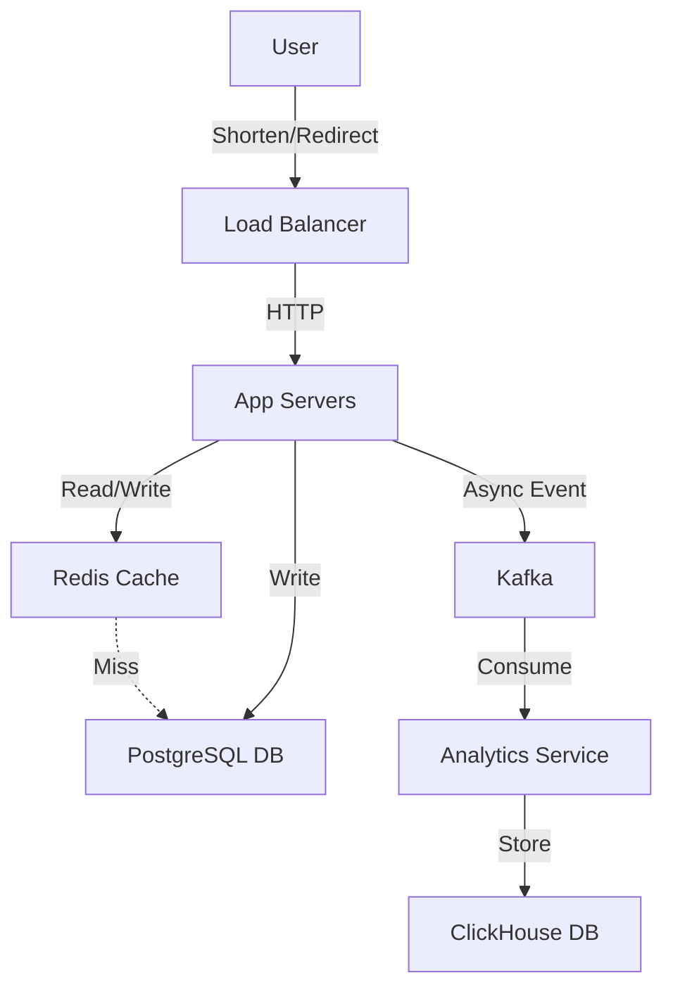

# URL Shortener - Failure Scenarios & Monitoring

## Step 5: Discuss Failure Scenarios & Monitoring

### Failure Scenario 1: Database Failure

**What happens?**
- Write requests fail or time out (cannot create new URLs).
- Read requests might still work if read replicas are up.

**How to detect:**
- Monitoring tools (Datadog/Prometheus) alert on DB connection errors or high latency.
- Health checks from App Servers fail.

**How to recover:**
- **Master Failure**: Automatic failover to a standby replica (e.g., using Patroni for PostgreSQL).
- **Replica Failure**: Remove from load balancer rotation; promote another if needed.

**Mitigation:**
- Replication (Master-Slave).
- Regular backups (PITR).

### Failure Scenario 2: Cache Failure

**What happens?**
- Latency increases as all read requests hit the database.
- Database load spikes (thundering herd).

**How to detect:**
- Cache connection timeout.
- High DB CPU usage/read IOPS.

**How to recover:**
- Restart cache cluster.
- Warm up cache if possible (though often not feasible quickly).

**Mitigation:**
- **Cluster Mode**: Redis Cluster with sharding and replication to avoid Single Point of Failure.
- **Circuit Breaker**: Fail fast if cache is down, checking DB directly but with rate limiting.

### Failure Scenario 3: Server Failure

**What happens?**
- Requests to that specific server fail (5xx).

**How to detect:**
- Load Balancer health checks (heartbeats) fail.

**How to recover:**
- Load Balancer automatically removes unhealthy node from rotation.

**Mitigation:**
- **Auto-scaling Group**: Automatically provision new instances to replace unhealthy or terminated ones.
- **Stateless Architecture**: Any server can handle any request; no session state to lose.

## Monitoring & Metrics

### Key Metrics to Track:
1. **Request Rate:**
   - Shortening requests per second
   - Redirect requests per second

2. **Latency:**
   - P50, P99 latency for redirects
   - Target: < 100ms

3. **Error Rate:**
   - 4xx errors (bad requests)
   - 5xx errors (server errors)

4. **Database:**
   - Query latency
   - Connection pool utilization

5. **Cache:**
   - Hit rate (target: > 80%)
   - Miss rate

### Alerting Rules:
- Error rate > 1% for 5 minutes
- P99 latency > 200ms for 5 minutes
- Cache hit rate < 70% for 10 minutes

## Summary & Final Diagram

**Your complete architecture diagram:**

**Key design decisions:**
1. **Base62 Encoding**: Optimal density and clear implementation with unique IDs.
2. **PostgreSQL**: Reliable, ACID compliant, simpler management than NoSQL for this scale.
3. **Async Analytics**: Decoupled from the main user path to ensure low latency redirects.

**Trade-offs made:**
1. **Latency vs Consistency**: Chosen strict consistency for writes (unique links) which might add ms, but ensures correctness.
2. **Features vs Complexity**: Added a distributed ID generator (Snowflake) requirement which adds operational complexity but solving collision handling elegantly.
3. **302 Redirects**: Sacrificing slight client-side caching (vs 301) for the ability to track every click for analytics.

## Resources
- [Bitly Architecture Blog](https://bitly.is/blog)
- [TinyURL System Design](https://www.educative.io)
