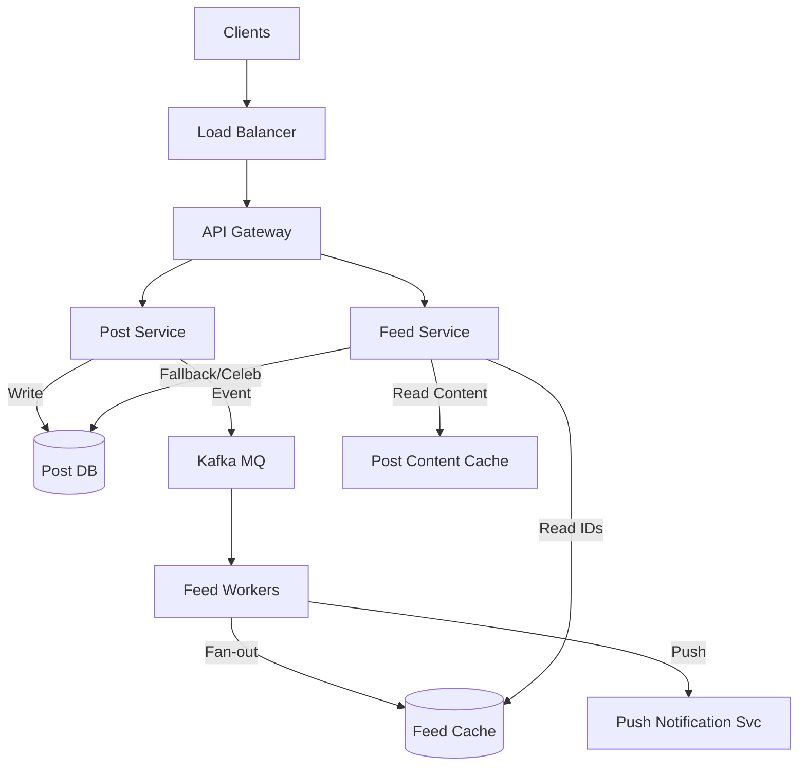

# Social Media Feed - Failure Scenarios

## Step 5: Failure Scenarios & Monitoring

### Failure Scenario 1: Message Queue Failure

**What happens?**
- Events are not processed, users' feeds stop updating (stale feeds).
- Posts are safe in DB, but not pushed to cache.

**How to detect:**
- Queue depth monitoring (lag increases).
- User complaints about missing posts.

**How to recover:**
- **Dead Letter Queue (DLQ)**: Failed events go here for manual/automated retry.
- **Backpressure**: Slow down ingestion if queue is full.

**Mitigation:**
- Kafka replication (min.insync.replicas).
- Multiple partitions to parallelize consumption.

### Failure Scenario 2: Feed Cache Failure

**What happens?**
- Read requests fall back to DB (heavy Scatter-Gather query).
- Latency spikes from 50ms to 2-3 seconds.

**How to detect:**
- Cache connection errors.
- DB CPU spike.

**How to recover:**
- Rate limit reads to DB to prevent cascade failure.
- Gradually warm up cache.

**Mitigation:**
- Redis Cluster (Sharding + Replication).
- **Circuit Breaker**: If Redis fails, return a "stale" or "empty" feed (degraded mode) instead of killing the DB.

### Failure Scenario 3: Database Hotspot (Celebrity Reads)

**What happens?**
- A celebrity posts, and millions request the post detail at once.
- "Thundering Herd" on the Post DB/Cache.

**How to detect:**
- Key-specific latency metrics.
- Hot key analysis in Redis.

**How to recover:**
- Increase replication factor for hot keys.

**Mitigation:**
- **Local Caching (App Server)**: Cache hot posts in the application memory for short duration (TTL 5s).
- **Request Coalescing**: Combine multiple requests for the same key into one DB call.

## Monitoring & Metrics

### Key Metrics:
1. **Feed Generation Latency:**
   - P50, P99 latency
   - Target: < 200ms

2. **Post Creation Latency:**
   - P99 < 500ms

3. **Cache Hit Rate:**
   - Target > 90% (Crucial for scatter-gather prevention)

4. **Message Queue Lag:**
   - Measure age of oldest message in queue. Alert if > 1 minute.

5. **Feed Freshness:**
   - Time between post creation and appearance in follower feeds.

## Summary

**Your complete architecture diagram:**

**Key design decisions:**
1. **Hybrid Fan-out**: Best balance for cost/performance.
2. **Redis Lists**: Simple, efficient structure for chronological feeds.
3. **Async Processing**: Decoupling writing from reading ensures snappy user experience.

**Fan-out strategy chosen:**
- **Hybrid**: Push for 99% of users, Pull for 1% (Celebrities).

**How you handle celebrities:**
- Posts are not pushed.
- Feed Service pulls them at read time and merges with the user's timeline.

## Resources
- [Instagram Feed Architecture](https://instagram-engineering.com)
- [Twitter Timeline Architecture](https://blog.twitter.com)
