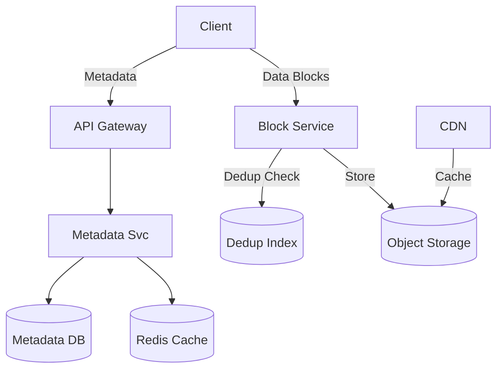

# Media Storage - Failure Scenarios & Monitoring

## Step 5: Failure Scenarios

### Failure Scenario 1: Data Corruption
**What happens?**
- A bit flips on the hard drive.
- Network error corrupts a packet during upload.

**Mitigation:**
1.  **Checksums**:
    *   Compute MD5/SHA256 at Client.
    *   Block Service verifies checksum upon receipt.
    *   Object Store (S3) stores checksum as metadata.
    *   Periodically read blocks and verify checksums (background scrubber).

### Failure Scenario 2: Metadata vs Object Storage Inconsistency
**What happens?**
- Metadata says "File A exists", but the block is missing in S3 (Orphan Reference).
- Block exists in S3, but no Metadata points to it (Orphan Block - Wasted money).

**Mitigation:**
1.  **Saga Pattern / Two-Phase Commit**: Not really needed.
2.  **Upload Flow**: Always write to S3 *first*. Only write metadata if S3 write succeeds.
3.  **Garbage Collection**:
    *   Run a background job (MapReduce/Spark).
    *   Scan S3 keys vs Metadata keys.
    *   Delete S3 keys that have no reference in Metadata DB (with a safety buffer of 24h).

### Failure Scenario 3: Hotspot (Viral File)
**What happens?**
- Everyone tries to download the same video at once.

**Mitigation:**
1.  **CDN (Content Delivery Network)**: Cache public/shared files at the edge (Cloudfront).
2.  **S3 Scaling**: S3 handles hotspots well, but we can distribute prefixes if needed.
3.  **Peer-to-Peer**: (Optional/Advanced) Use BitTorrent-like protocol for internal client syncing.

## Monitoring & Metrics

### Key Metrics:
1.  **Storage Usage**: Total bytes, Growth rate.
2.  **Upload/Download Latency**: P99 (Target < 2s for 10MB).
3.  **Availability**: Error rates on API.
4.  **Deduplication Ratio**: % of space saved.

## Summary

**Architecture Diagram:**

**Key Decisions:**
1.  **S3 for Storage**: Cost/Scale.
2.  **SQL for Metadata**: Consistency.
3.  **Client-side Chunking**: Resumability and Dedup.

## Resources
- [Dropbox Architecture](https://dropbox.tech)
